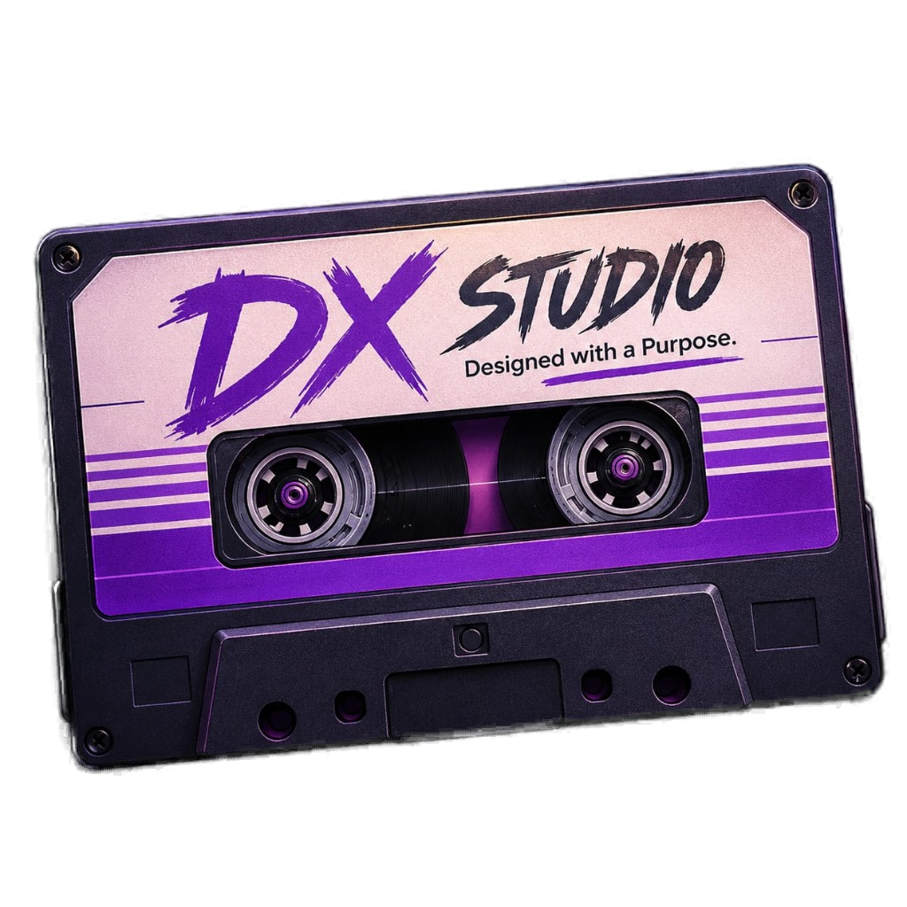
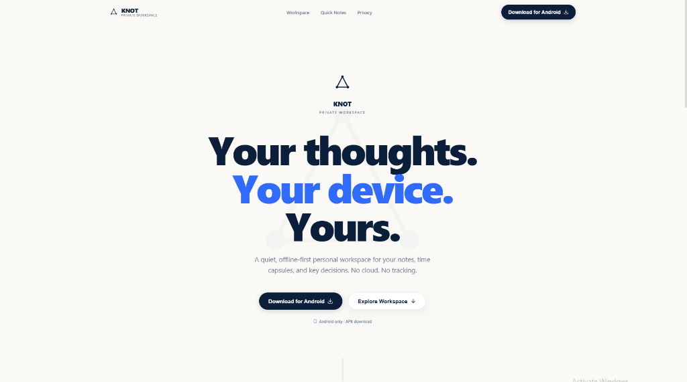
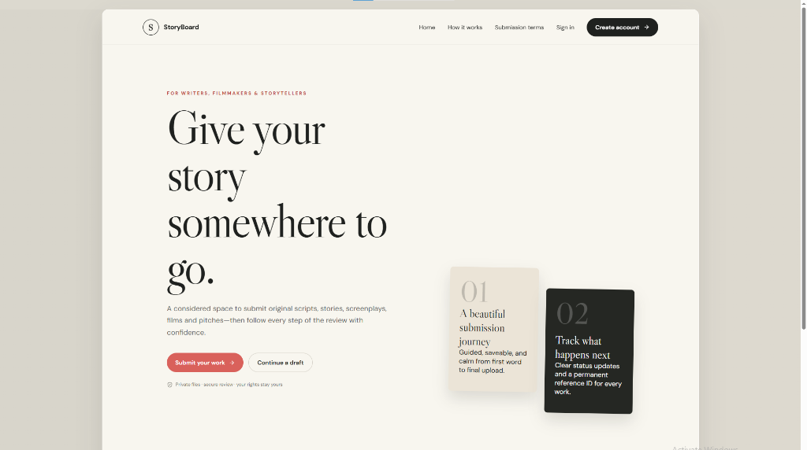
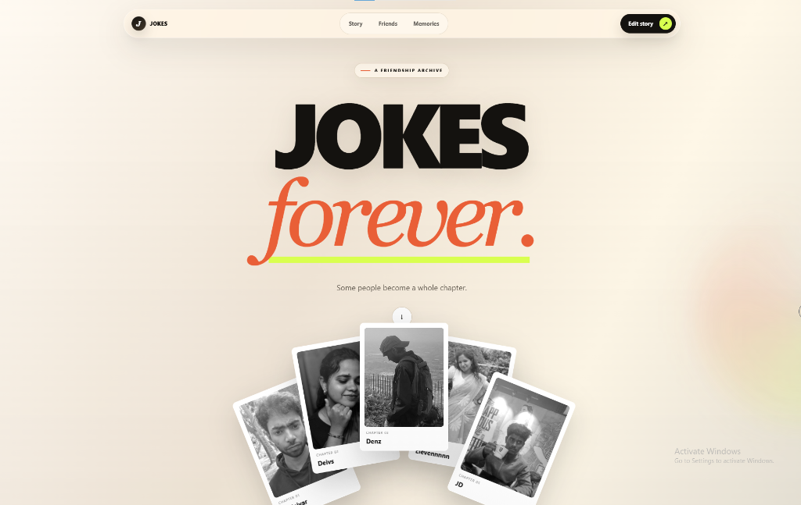

# DX STUDIO — Designed with a Purpose

<div align="center">
  

  <br />

  <h3><strong>Apple-Level Restraint × Awwwards-Grade Interaction × Cinematic Motion Architecture</strong></h3>

  <p>
    An independent digital studio crafting purposeful products, interfaces, and interactive systems at the intersection of design, technology, and storytelling.
  </p>

  <br />

  <a href="https://github.com/denzilsamuel718/dxstudio">
    
  </a>
  <a href="https://github.com/denzilsamuel718/dxstudio">
    
  </a>
  <a href="https://github.com/denzilsamuel718/dxstudio">
    
  </a>
  <a href="https://github.com/denzilsamuel718/dxstudio">
    
  </a>
  <a href="https://github.com/denzilsamuel718/dxstudio">
    
  </a>
  <a href="https://github.com/denzilsamuel718/dxstudio">
    
  </a>
</div>

---

## ✦ Architectural Highlights

- 🎵 **Continuous Background Soundtrack**: Single application-wide audio engine with seamless infinite looping, smooth volume ramping (`0 → 0.22`), and tab-visibility protection.
- 📼 **Top Navbar Cassette Toggle**: Miniature analog cassette widget with dual spinning tape spools and electric purple illumination.
- 🎛️ **Cinematic Slit-Mask Intro**: Fluid `00 → 100%` counter with vertical curtain slit reveal and audio consent options (`ENTER WITH SOUND` / `ENTER MUTED`).
- 🧭 **Real-Time Scroll Spy Navigation**: Active section tracking across `PROJECTS → ABOUT → PROCESS → PHILOSOPHY → CONTACT` with spring-damped layout indicators and live IST clock.
- 👾 **Spatial 3D Hero Cassette**: High-resolution transparent cassette with 3D perspective mouse tilt, mobile touch physics, and GSAP scroll-bound transformations.
- 👤 **Interactive 3D Studio Identity**: Sub-pixel alpha-matted 3D character avatar with interactive spatial tilt and floating name badge on proximity/hover.
- 📱 **100% Multi-Device Responsive**: Flawless experience across smartphones (320px–430px), tablets (iPad / Surface), laptops, and 4K ultra-wide monitors.

---

## ✦ Featured Productions

<div align="center">

### 01 / KNOT — Private Offline Workspace
*An offline-first private workspace engineered for extreme clarity, zero tracking, and user sovereignty.*



<br />

### 02 / STORYBOARD — Creative Submission Platform
*A publication-grade editorial submission platform for writers, screenplays, and story architectures.*



<br />

### 03 / JOKES — Interactive Friendship Archive
*An intimate, card-stacked digital memorial celebrating memories, chapters, and lifelong bonds.*



</div>

---

## ✦ Methodology: How We Build

| Phase | Title | Focus |
| :---: | :--- | :--- |
| **`01`** | **DISCOVER** | *Understand the idea.* Problem definition, architecture strategy, and visual direction. |
| **`02`** | **DESIGN** | *Shape the experience.* Purposeful user interfaces, motion choreography, and design systems. |
| **`03`** | **BUILD** | *Turn systems into reality.* Production-grade Next.js, React 19, and GSAP interactive architectures. |
| **`04`** | **REFINE** | *Obsess over the details.* Frame rate tuning, accessibility standards, haptics, and performance audits. |

---

## ✦ Design System & Color Palette

```css
--bg-primary:     #050505; /* Obsidian Abyss */
--bg-surface:     #09090C; /* Charcoal Slate */
--text-primary:   #F5F5F5; /* Pure Foreground */
--text-secondary: #96969D; /* Muted Smoke */
--dx-purple:      #7C2AE8; /* Core Electric Purple */
--dx-purple-glow: #A64DFF; /* Luminous Neon Accent */
```

---

## ✦ Project Structure

```
dx-studio/
├── public/
│   ├── assets/
│   │   ├── audio/              # Continuous soundtrack (dx-music.mp4 / .m4a)
│   │   ├── projects/           # High-resolution production screenshots
│   │   ├── dx-cassette-transparent.png # 3D Hero cassette asset
│   │   └── denzil-character.png # Sub-pixel alpha-matted avatar
│   └── favicon.ico             # Studio favicon
├── src/
│   ├── app/
│   │   ├── layout.tsx          # Root layout with AudioProvider & FilmGrain
│   │   ├── page.tsx            # Main single-page interactive experience
│   │   └── globals.css         # Typography, custom scrollbars & utilities
│   ├── components/
│   │   ├── audio/              # SoundToggle cassette component
│   │   ├── hero/               # CassetteVisual 3D tilt & HeroSection
│   │   ├── intro/              # Cinematic slit-mask loader
│   │   ├── navigation/         # Scroll spy Navbar & MobileMenu
│   │   ├── projects/           # Featured project showcases & case study modal
│   │   ├── about/              # DenzilCharacter 3D avatar & marquee
│   │   ├── process/            # 4-stage methodology
│   │   ├── contact/            # Magnetic CTA & direct connection channels
│   │   └── footer/             # Giant unclipped DX STUDIO signature
│   ├── context/
│   │   └── AudioContext.tsx    # Application-wide audio engine singleton
│   └── data/
│       ├── projects.ts         # Modular project metadata
│       └── studio.ts           # Studio identity, services & links
```

---

## ✦ Local Development

1. **Clone the repository**:
   ```bash
   git clone https://github.com/denzilsamuel718/dxstudio.git
   cd dxstudio
   ```

2. **Install dependencies**:
   ```bash
   npm install
   ```

3. **Start local development server**:
   ```bash
   npm run dev
   ```

4. Open **[http://localhost:3000](http://localhost:3000)** in your browser.

---

## ✦ Creator & Studio Credits

* **Founder & Creative Technologist**: [Denzil Samuel](https://github.com/denzilsamuel718)
* **LinkedIn**: [Denzil Samuel Profile](https://www.linkedin.com/in/denzil-samuel-b49658420)
* **Inquiries**: `contactdxstudio.design@gmail.com`

<div align="center">
  <sub>© 2026 DX STUDIO. All rights reserved. Designed with a Purpose.</sub>
</div>
